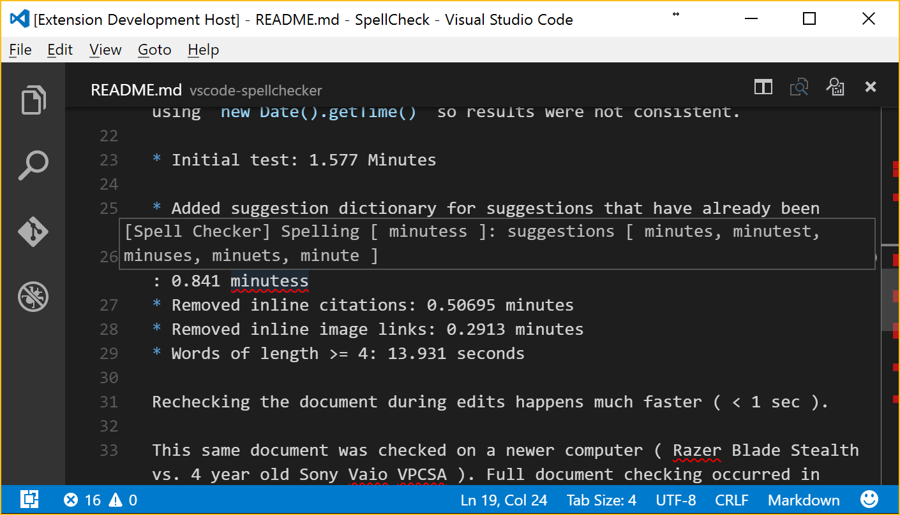
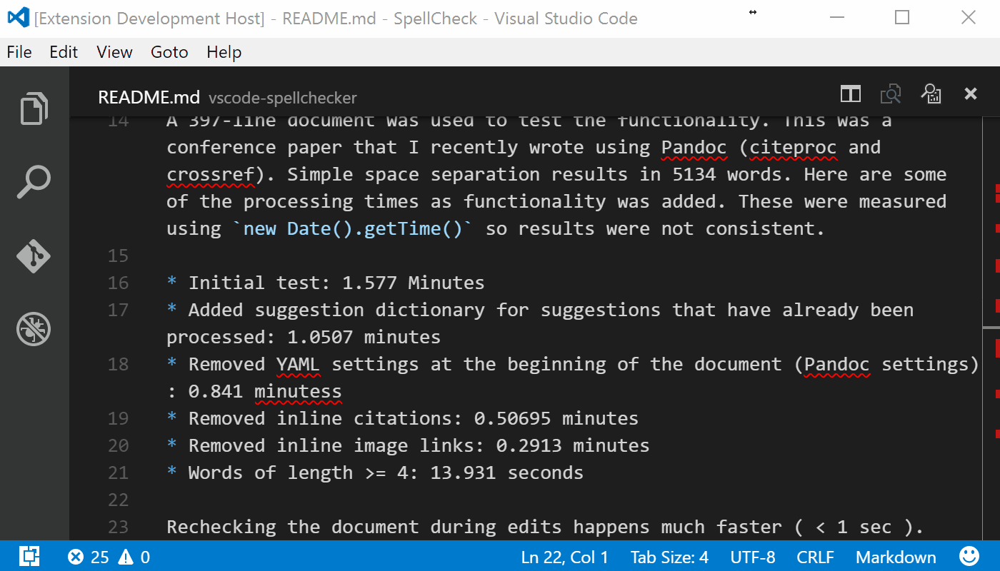

**WARNING**: Early development version, forked from [swyphcosmo's vscode-spellchecker v1.2.9](https://marketplace.visualstudio.com/items?itemName=swyphcosmo.spellchecker), for French language support ([as discussed there](https://github.com/swyphcosmo/vscode-spellchecker/issues/31)). Only tested on Mac OS X, so far. Some parts of code may be unnecessary, and some parts of documentation irrelevant.

> [Switching from the Hunspell submodule to Atom's node-spellcheck npm module](https://github.com/adrienjoly/vscode-spellchecker/commit/66b18efbc513265580f34d041da0a29d58c3eba5) solved my French spelling problems, and runs much faster.
> 
> One drawback is that the extension needs to be compiled separately for each platform, because [Atom's node-spellcheck npm module](https://github.com/atom/node-spellchecker) is a native module. And I had to use [electron-rebuild](https://github.com/electron/electron/blob/master/docs/tutorial/using-native-node-modules.md#the-easy-way) in order to compile accordingly to [VSCode's Electron version](https://code.visualstudio.com/docs/extensions/patterns-and-principles#_common-questions).

# Offline French Spell Checker

[](https://marketplace.visualstudio.com/items?itemName=swyphcosmo.spellchecker)
[](https://marketplace.visualstudio.com/items?itemName=swyphcosmo.spellchecker)

## Description 

This extension is a spell checker that uses a local dictionary for offline usage. Atom's [node-spellchecker module](https://github.com/atom/node-spellchecker) is used to load NSSpellChecker, Hunspell, or the Windows 8 Spell Check API, depending on your platform. Errors are highlighted, and hovering over them will show possible suggestions.

This extension can be found on the [VSCode Marketplace](https://marketplace.visualstudio.com/items?itemName=swyphcosmo.spellchecker).

## Functionality

Once errors are highlighted, there are several ways to view word suggestions.

Hover over the error: 



By pressing `F8` to step through errors:


You can correct the error by clicking on the Quick Fix (light bulb) icon. 



## Configuration File

You can configure the operation of this extension by placing a file called `spellchecker.json` into your workspace's `.vscode` folder.

An example configuration file can be found [here](https://github.com/adrienjoly/vscode-spellchecker/blob/samples/en/.vscode/spellchecker.json). 

The following settings can be changed:

* `language`: tested languages are French (`"fr"`, by default) and English (`"en_US"`).
* `ignoreWordsList`: an array of strings that contain the words that will not be checked by the spell checker
* `documentTypes`: an array of strings that limit the document types that this extension will check. Default document types are `"markdown"`, `"latex"`, and `"plaintext"`.
* `ignoreFileExtensions`: an array of file extensions that will not be spell checked
* `checkInterval`: number of milliseconds to delay between full document spell checks. Default: 5000 ms.
* `ignoreRegExp`: an array of regular expressions that will be used to remove text from the document before it is checked. Since the expressions are represented in the JSON as strings, all backslashes need to be escaped with three additional backslashes, e.g. `/\s/g` becomes `"/\\\\s/g"`. The following are examples provided in the example configuration file:
	* `"/\\\\(.*\\\\.(jpg|jpeg|png|md|gif|JPG|JPEG|PNG|MD|GIF)\\\\)/g"`: remove links to image and markdown files
	* `"/((http|https|ftp|git)\\\\S*)/g"`: remove hyperlinks
	* `"/^(```\\\\s*)(\\\\w+)?(\\\\s*[\\\\w\\\\W]+?\\\\n*)(```\\\\s*)\\\\n*$/gm"`: remove code blocks

Additional sections are already removed from files, including:

* YAML header for [pandoc](http://pandoc.org/) settings
* `&nbsp;`
* Pandoc citations 
* Inline code blocks
* Email addresses

>**Note:** If this file is updated manually, you will need to reload VSCode for changes to take effect.

The `Create Spell Checker Settings File` command has been provided to add a default settings file to the current workspace if one does not already exist.

## Global Configuration

As of `v1.2.0`, you can add any of the settings in `spellchecker.json` to the User Preferences `settings.json`. Be sure to add `'spellchecker.'` to any of the settings. For example, add words to ignore to the variable `"spellchecker.ignoreWordsList"`.

## Known Issues

* Entire file is rechecked with each update
* Tested on Mac OS only

## TODO

* Add command to change language

## License

MIT
